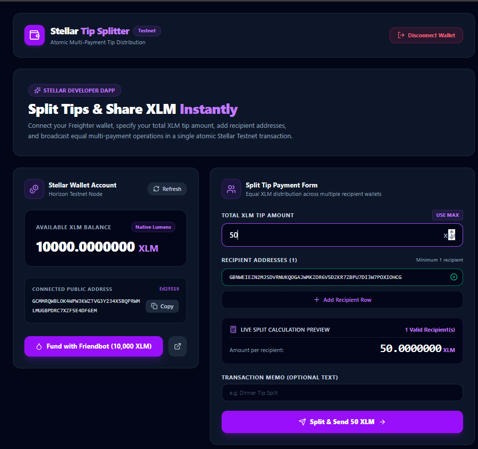
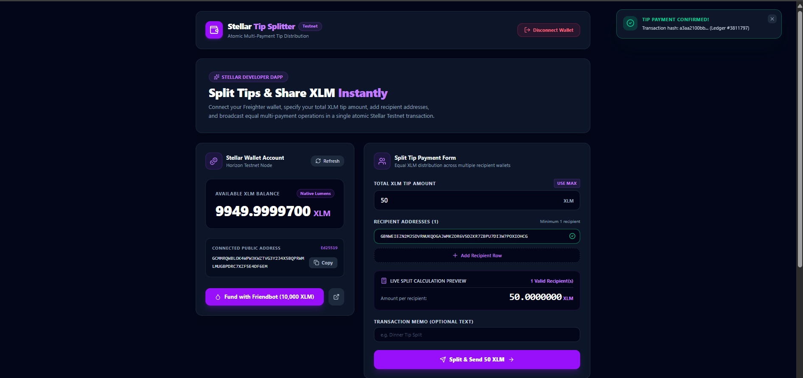
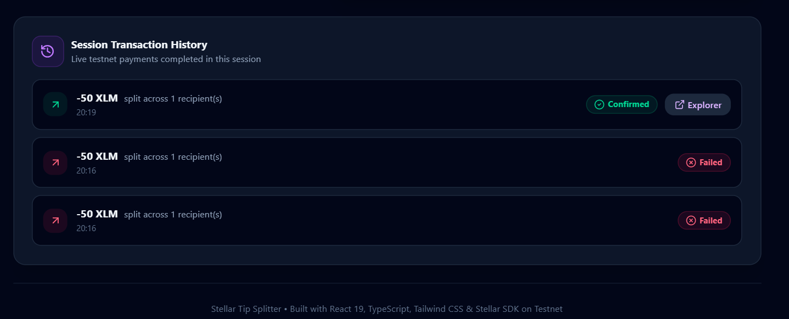

# Stellar Tip Splitter 💸🌟

A professional Web3 dApp for distributing XLM tip payments across multiple recipient addresses in a single atomic Stellar Testnet transaction.


---

## Screenshots

### Wallet Connected & Balance Displayed



### Successful Testnet Transaction



### Transaction Result & History



## 🌟 Key Features

- 🔐 **Wallet Connection (`getAddress()` + `requestAccess()`)**: Uses modern `@stellar/freighter-api` methods only (`getAddress()` with `requestAccess()` fallback). Extracts `.address` safely from response objects.
- 🔌 **Full State Reset Disconnect**: Disconnect button clears wallet address, XLM balance, form inputs, toasts, and history state.
- 💰 **Horizon Account Balance (`WalletCard`)**: Queries native XLM balance via Horizon server (`https://horizon-testnet.stellar.org`). Shows `Account Not Funded` if unfunded (404) with a Friendbot faucet button.
- 🚰 **Friendbot Testnet Faucet**: 1-click testnet account funding tool (claims 10,000 test XLM instantly).
- 🍕 **Tip Split Engine (`SplitForm`)**: Input total XLM tip amount and dynamic recipient input rows. Automatically calculates live `X.XX XLM per recipient` preview above the submit button.
- ✅ **Inline Address Validation**: Validates recipient addresses in real-time using `StrKey.isValidEd25519PublicKey` and shows a green checkmark or red X icon next to each input row.
- ⚡ **Atomic Multi-Payment Building**: Builds a single transaction using `StellarSdk.TransactionBuilder` containing one `Operation.payment` per recipient.
- 🔐 **Freighter Transaction Signing**: Signs transaction XDR via `signTransaction()` with network passphrase `Networks.TESTNET`.
- 🔔 **Auto-Dismissing Toast Notifications**: Top-right sliding notifications (green checkmark for success, red X for errors) that auto-dismiss after 5 seconds.
- 📜 **Session Transaction History**: Displays completed transfers with recipient count, timestamp, and links to [Stellar Expert Explorer](https://stellar.expert/explorer/testnet).
- ⚠️ **Network Check Warning**: Checks active Freighter network (`getNetworkDetails()`) and displays a persistent warning banner if the wallet is not on Testnet.

---

## 🛠️ Architecture & Files

```
stellar-white-belt/
├── src/
│   ├── components/
│   │   ├── NetworkWarning.tsx  # Persistent warning when wallet is not on Testnet
│   │   ├── WalletCard.tsx      # Balance (text-4xl), copy address button, Friendbot faucet
│   │   ├── SplitForm.tsx       # Amount input, dynamic recipient rows, live calculation preview
│   │   ├── TxHistory.tsx       # Session activity list with Stellar Expert explorer links
│   │   └── Toast.tsx           # Top-right sliding notifications (auto-dismiss 5s)
│   ├── services/
│   │   └── stellar.ts          # Stellar SDK + Freighter integration (getAddress, requestAccess)
│   ├── App.tsx                 # Main application state composition
│   ├── index.css               # Dark theme (#0a0a0f) & Tailwind CSS v4 setup
│   └── main.tsx                # Application entrypoint
├── index.html
├── package.json
├── tsconfig.json               # TypeScript configuration
├── vercel.json                 # Vercel deployment configuration
└── vite.config.ts              # Vite configuration with Node polyfills
```

---

## ⚙️ Getting Started

### Prerequisites

1. **Node.js**: Node.js v18 or higher installed.
2. **Freighter Extension**: Install Freighter browser extension from [Freighter.app](https://www.freighter.app/).

### Installation & Local Run

1. Clone repository and install dependencies:

   ```bash
   npm install
   ```

2. Start the Vite development server:

   ```bash
   npm run dev
   ```

3. Open `http://localhost:3000` in your browser.

---

## 🌐 Deploy to Vercel

Pre-configured with `vercel.json`:

1. Push your repository to GitHub / GitLab.
2. Import project into [Vercel](https://vercel.com).
3. Framework preset: **Vite**, Build command: `npm run build`.
4. Click **Deploy**.

---

## 📜 License

MIT License. Built for the Stellar Testnet Developer Challenge.
